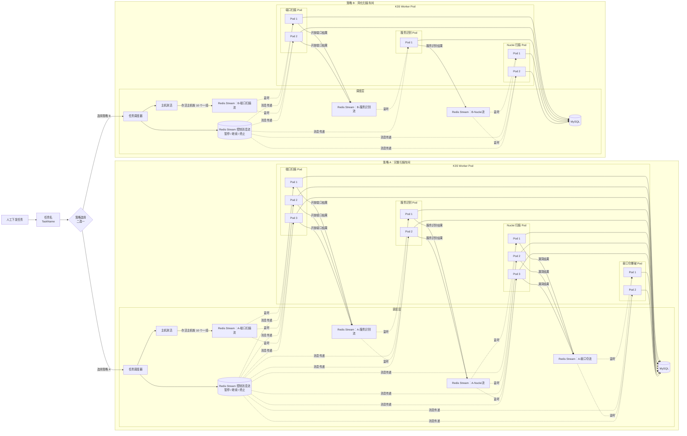

# DAST

基于 K3s 集群的分布式 DAST平台。

## 架构设计

大致的架构设计如下：



需要注意：是推送消息到redis stream中，然后pod从redis stream取消息，这个顺序不要搞错了。

核心设计：

- 基于redis stream的消息队列以及消息广播。
- 基于k8s的configmap机制实现各pod的运行参数设置
- 基于redis分布式锁实现分布式扫描调度
- 基于go语言的rate库及sdk选项实现qps限制
- 基于client-go库的集群调度

整体是实现扫描模块的pod公用，类似一种流水线车间。


特点：

- 支持自定义策略中的扫描模块，可自定义每个策略的扫描工作流。
- 基于策略创建的扫描车间，不同策略可以配置扫描模块的相关运行参数，由此搭建不同的扫描车间
- 没有策略相关任务运行时，支持暂时停用策略（即将replicas设置为0）
- 支持扫描策略动态更新，即支持deployment动态更新，实时更改扫描pod的扫描规范。
- 支持通过api+token进行第三方调度。


每个策略是一套隔离的“扫描车间”，启用一个完整的策略，会创建如下"介质"：

```text
Redis Streams:
  dast:policy:{policyID}:portscan
  dast:policy:{policyID}:nmap
  dast:policy:{policyID}:nuclei
  dast:policy:{policyID}:weakpass
  dast:policy:{policyID}:control
  Control Stream:
    dast:policy:{policyID}:control
    控制流按广播方式读取，不使用共享 Consumer Group；每个 Pod 自己保存 lastControlID，初始id使用$，只接收最新消息。

Consumer Groups:
  group:policy:{policyID}:portscan
  group:policy:{policyID}:nmap
  group:policy:{policyID}:nuclei
  group:policy:{policyID}:weakpass

K3s Resources:
  ConfigMap:  dast-policy-{policyID}-{module}-config
  Deployment: dast-policy-{policyID}-{module}
```

下发任务时选择扫描策略，不同任务的扫描目标分片后打上各自的任务标记后均投入到对应策略的扫描车间。


## 各项运行参数

### 后端环境变量

| 变量                        | 默认值                      | 说明                                                         |
| --------------------------- | --------------------------- | ------------------------------------------------------------ |
| `DAST_LISTEN`               | `:8080`                     | 后端 HTTP 监听地址                                           |
| `DAST_JWT_SECRET`           | `dast-dev-secret-change-me` | JWT 签名密钥，生产必须修改                                   |
| `DAST_API_TOKEN`            | 空                          | 外部 API 调用凭证。请求头使用 `X-DAST-Token`，为空时禁用该方式 |
| `DAST_DB_HOST`              | `127.0.0.1`                 | 后端连接 MySQL 地址                                          |
| `DAST_DB_PORT`              | `3306`                      | 后端连接 MySQL 端口                                          |
| `DAST_DB_USER`              | `root`                      | 后端连接 MySQL 用户                                          |
| `DAST_DB_PASS`              | `root`                      | 后端连接 MySQL 密码                                          |
| `DAST_DB_NAME`              | `dast`                      | 后端连接 MySQL 数据库                                        |
| `DAST_REDIS_ADDR`           | `127.0.0.1:6379`            | 后端连接 Redis 地址，格式为 `host:port`                      |
| `DAST_REDIS_PASS`           | `redis`                     | 后端连接 Redis 密码。Redis 无密码时需要显式设为空            |
| `DAST_REDIS_DB`             | `0`                         | Redis DB                                                     |
| `DAST_K8S_NAMESPACE`        | `dast-system`               | 默认 K3s/K8s 命名空间                                        |
| `DAST_SCHEDULER_IP`         | `10.0.0.1`                  | 写入策略默认模板和扫描器 ConfigMap 的调度层内网 IP           |
| `DAST_SCHEDULER_REDIS_PORT` | `6379`                      | 写入扫描器 ConfigMap 的 Redis 端口                           |
| `DAST_SCHEDULER_MYSQL_PORT` | `3306`                      | 写入扫描器 ConfigMap 的 MySQL 端口                           |
| `DAST_LOCK_TTL_SECONDS`     | `360`                       | 扫描器 Redis 分布式锁 TTL，写入 ConfigMap                    |
| `DAST_LOCK_RENEW_SECONDS`   | `300`                       | 扫描器锁续期间隔，写入 ConfigMap                             |
| `DAST_PENDING_IDLE_SECONDS` | `120`                       | Redis PEL 恢复 idle 阈值，写入 ConfigMap                     |
| `DAST_TARGET_BATCH_SIZE`    | `10`                        | 后端任务目标分片大小，最大 10                                |
| `DAST_TIMEZONE`             | `Asia/Shanghai`             | 后端写库时间和 MySQL DSN `loc`                               |
| `DAST_ADMIN_USER`           | `admin`                     | 首次启动种入的管理员用户名                                   |
| `DAST_ADMIN_PASS`           | `admin`                     | 首次启动种入的管理员密码                                     |
| `KUBECONFIG`                | 空                          | 可选。client-go 优先使用该路径连接 K3s/K8s                   |

### 扫描模块运行参数

各扫描模块的仓库地址：

- 端口扫描模块：https://github.com/fupanc-w1n/scanner-portscan
- 服务识别模块：https://github.com/fupanc-w1n/scanner-nmap
- 漏洞扫描模块：https://github.com/fupanc-w1n/scanner-nuclei
- 弱口令扫描模块：https://github.com/fupanc-w1n/scanner-weakpass

扫描模块可定义的环境变量：

| 变量              | 代码默认值                    | 说明                                                         |
| ----------------- | ----------------------------- | ------------------------------------------------------------ |
| `DAST_CONFIG`     | `/app/config/config.json`     | ConfigMap 挂载后的配置文件路径                               |
| `DAST_DB_USER`    | `root`                        | 扫描器连接 MySQL 用户                                        |
| `DAST_DB_PASS`    | `root`                        | 扫描器连接 MySQL 密码。若镜像 Dockerfile 或 Deployment 设置了该变量，以容器实际环境变量为准 |
| `DAST_DB_NAME`    | `dast`                        | 扫描器连接 MySQL 数据库                                      |
| `DAST_REDIS_PASS` | `redis`                       | 扫描器连接 Redis 密码。Redis 无密码时需要显式设为空          |
| `TZ`              | `Asia/Shanghai`               | 扫描器写库时间时区，优先级高于 `DAST_TIMEZONE`               |
| `DAST_TIMEZONE`   | `Asia/Shanghai`               | `TZ` 为空时使用                                              |
| `POD_NAME`        | Pod hostname 或 UUID fallback | 生成 Redis consumer name 和分布式锁 value。后端创建 Deployment 时通过 Downward API 注入 |

扫描器模块参数由策略写入 ConfigMap 的 `module_config`定义：

| 模块       | 参数                  | 说明                                                     |
| ---------- | --------------------- | -------------------------------------------------------- |
| `portscan` | `ports`、`qps`        | TCP 端口范围和单 host 扫描速率                           |
| `nmap`     | `qps`                 | nmap `--max-rate`                                        |
| `nuclei`   | `qps`、`template_ids` | Nuclei 全局速率和模板 ID。`template_ids=[]` 表示全量模板 |
| `weakpass` | `qps`、`dictionary`   | 每 host 弱口令尝试速率和 SSH/MySQL/Redis 字典            |

在实际运行中，扫描器 Pod 会读取通过ConfigMap机制挂载在本地的文件，参考全量扫描的nmap扫描模块的配置文件：

```json
{
  "policy_id": 1,
  "module": "nmap",
  "scheduler": {
    "internal_ip": "your-SCHEDULER-ip",
    "redis_port": 6379,
    "mysql_port": 3306
  },
  "redis": {
    "stream": "dast:policy:1:nmap",
    "group": "group:policy:1:nmap",
    "control_stream": "dast:policy:1:control",
    "control_broadcast": true,
    "lock_ttl_seconds": 360,
    "lock_renew_seconds": 300,
    "pending_idle_seconds": 120
  },
  "workflow": {
    "downstreams": {
      "http": {
        "module": "nuclei",
        "stream": "dast:policy:1:nuclei"
      },
      "weakpass": {
        "module": "weakpass",
        "stream": "dast:policy:1:weakpass"
      }
    }
  },
  "module_config": {
    "qps": 150
  }
}
```

扫描模块的pod会读取该配置文件并做相关扫描配置。

## 快速开始

### 前置条件

- Go 1.26+（以 `backend/go.mod` 为准）
- Node 20+
- MySQL 8，字符集建议 `utf8mb4`
- Redis 6+
- K3s/K8s 集群
- 可访问的扫描器镜像仓库，例如 GHCR

启动前创建数据库：

```sql
CREATE DATABASE IF NOT EXISTS dast DEFAULT CHARSET utf8mb4 COLLATE utf8mb4_unicode_ci;
```

可选预建命名空间。默认命名空间是 `dast-system`，后端部署策略时也会自动创建：

```shell
kubectl create namespace dast-system
```

另外需要注意做好集群的配置，如果是直接关闭防火墙搭建的集群，那么这里直接用就行，如果是通过开放端口搭建的集群，需要防火期开放对应的端口，比如mysql的3306、redis的6379，从而允许pod连接到调度层的mysql和redis服务。


### 后端初始化与运行

需先在后端运行环境中打入的环境变量：

```shell
export DAST_JWT_SECRET="$(openssl rand -hex 32)"  #必需，jwt密钥
export DAST_DB_PASS='your-mysql-password' #按需，你的mysql数据库密码
export DAST_REDIS_PASS='your-redis-password' #按需，你的redis数据库密码
```

然后如下运行即可：

```bash
cd backend

# 首次拉依赖，或依赖变更后执行
# 国内网络若卡住，可以加：GOPROXY=https://goproxy.cn,direct
go mod tidy

# 运行
go run ./cmd/api
# 后端监听 :8080，首次启动会 AutoMigrate 表，并种入 admin/admin
```

### 前端初始化与运行

```bash
cd frontend
npm install            # 首次
npm run dev            # 开发：http://localhost:5173，自动反代 /api -> :8080
```

### 运行效果

初始默认账号admin/admin，可以通过 `DAST_ADMIN_USER` 和 `DAST_ADMIN_PASS` 修改首次种入的账号：


支持如下功能：


集群初始状态：


创建策略：


随后集群内会拉取对应镜像并创建对应pod：


创建任务：


扫描结果：


开放端口结果：


服务识别结果：


漏洞扫描结果：


支持漏洞举证：


弱口令扫描结果：


事件：


用于记录扫描分片的进度以及任务的处理。

### 第三方调度

支持通过api+token下发任务以及获取任务结果。

#### example

后端运行服务器添加token环境变量：

```shell
export DAST_API_TOKEN='a8K2xP9mQ4tY7n'
```

然后再运行后端，即可直接通过api下发任务。

- 获取策略：

```python
import requests

headers ={
    "X-DAST-Token":"a8K2xP9mQ4tY7n"
}
url = "your-ip"

res = requests.get(url+"/api/v1/policies",headers=headers)
print(res.json())
```

会返回策略内容。

- 下发任务：

```python
import requests

headers ={
    "X-DAST-Token":"a8K2xP9mQ4tY7n",
    "Content-Type":"application/json"
}
url = "your-ip"

json = {
    "name":"全链路扫描测试",
    "policy_id":1,
    "targets":["www.baidu.com","192.168.1.2"]
}

res = requests.post(url+"/api/v1/tasks",headers=headers,json=json)
print(res.json())
```

会返回task_id：

```json
{'id': 12}
```

- 获取任务扫描结果：

```python
import requests

headers ={
    "X-DAST-Token":"a8K2xP9mQ4tY7n"
}
url = "your-ip"

response = requests.get(url+"/api/v1/tasks/12",headers=headers) #判断任务完成情况
res = response.json()
if res["task"]["status"] == "completed":
     weak_result = requests.get(url + "/api/v1/tasks/12/results/weak-passwords", headers=headers) #弱口令结果
     vulnerabilities_result = requests.get(url + "/api/v1/tasks/12/results/vulnerabilities", headers=headers)  #漏扫结果
     #services：服务识别，ports：端口扫描
print(weak_result.json())
print(vulnerabilities_result.json())
```

会返回各扫描模块扫描结果。

## 项目结构

```text
backend/          后端调度层，Gin + GORM + Redis + client-go
  cmd/api/        后端入口
  internal/api/   HTTP router、handler、middleware
  internal/config 环境变量配置
  internal/model  GORM 表模型
  internal/policy 策略 JSON、工作流、ConfigMap 内容生成
  internal/k8s    K3s/K8s client-go 封装
  internal/service/scheduler
                  主机测活、任务分片、策略部署、控制流

frontend/         Vue 3 + Element Plus 管理后台
  src/api/        API client
  src/views/      策略、任务、资源、登录页面
  src/components/ 布局组件
```

## 注意事项

- 生产环境必须修改 `DAST_JWT_SECRET`。
- 生产环境建议配置 `DAST_API_TOKEN`，用于外部系统通过 API 下发任务和查询结果。
- 默认管理员 `admin/admin` 只适合本地开发，生产必须修改。
- 任何服务不要使用弱密码。
